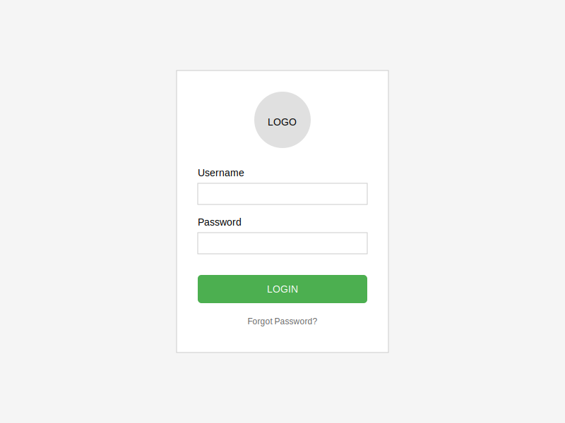
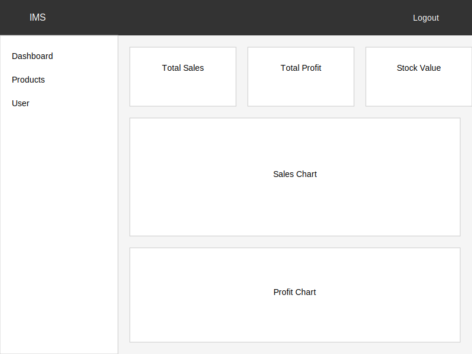
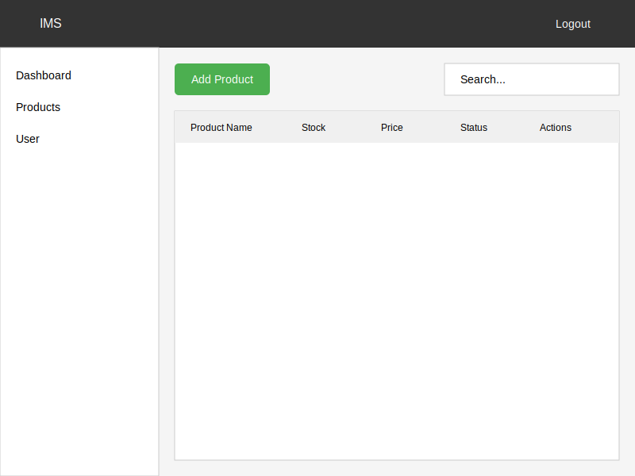
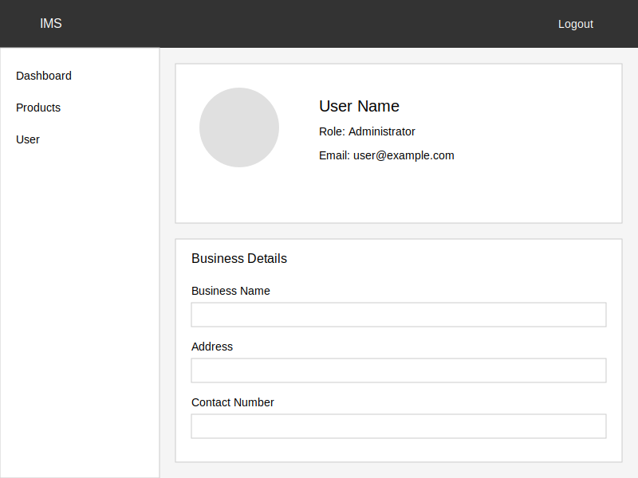

# Inventory Management System  

## User Login Page  

### Overview  
The user login page allows authorized users to access the system securely.  

### Features  
- Secure login with username and password  
- Password recovery option  

---  

## Dashboard  

### Overview  
The dashboard provides an overview of sales and profits in graphical format.  

### Features  
- Display sales and profit data in daily, weekly, and monthly charts  
- Key performance indicators (KPIs)  
- Filter sales reports by time range  

---   

## Product & Stock Page  

### Overview  
This page manages product details and stock levels.  

### Features  
- Add, edit, or delete products  
- Track stock availability  
- Receive stock alerts  

---  

## User  

### Overview  
The user page contains general business details and user information.  

### Features  
- Display company information  
- User profile section  

[def]: "./"